<div align="center">

<!-- ░░ ANIMATED HEADER ░░ -->


<!-- ░░ TYPING INTRO (animated) ░░ -->
<a href="https://github.com/aavartak">
  
</a>

<br/>

<!-- ░░ ANIMATED DIVIDER ░░ -->


<!-- ░░ NEOFETCH PROFILE CARD (animated) ░░ -->


<!-- ░░ LIVE COUNTERS ░░ -->


</div>

<br/>

<div align="center">

## `>` whoami

</div>

```c
#include <stdio.h>

typedef struct {
    const char *name;
    const char *role;
    const char *base;
    const char *stack[5];
    const char *now_building;
} Dev;

int main(void) {
    Dev me = {
        .name         = "aavartak",
        .role         = "Computer Engineer",
        .base         = "Virar West, Maharashtra, India",
        .stack        = { "C", "C++", "React", "PostgreSQL", "CyberSec" },
        .now_building = "paisabuddy  |  FinTrack"
    };

    printf("Hi! I break things, read the stack trace, then build them better.\n");
    return 0;   /* still compiling my dreams */
}
```

<div align="center">


## `>` tech arsenal

<!-- ░░ ANIMATED SKILL MARQUEE ░░ -->


<br/>

<!-- ░░ ICON WALL (shields with logos) ░░ -->


<br/><br/>


## `>` github pulse

<!-- ░░ ANIMATED STATS ░░ -->


<br/><br/>

<!-- ░░ ANIMATED STREAK ░░ -->


<br/><br/>

<!-- ░░ ANIMATED CONTRIBUTION GRAPH ░░ -->


<br/>

<!-- ░░ TROPHY SHELF ░░ -->


## `>` currently

</div>

<table>
<tr>
<td width="50%" valign="top">

**🔨 Building**

- `paisabuddy` — personal finance, made friendly
- `FinTrack` — track every rupee, beautifully

**🌱 Learning**

- Deeper C++ (templates, RAII, move semantics)
- Offensive security fundamentals
- Query tuning in PostgreSQL

</td>
<td width="50%" valign="top">

**🎯 Goals**

- Ship one polished project every quarter
- Contribute to an open-source systems project
- Write about what I break and fix

**⚡ Fun fact**

- My favourite debugger is a well-placed `printf`.

</td>
</tr>
</table>

<div align="center">


## `>` reach me

[](https://github.com/aavartak)
[](mailto:av.project.2103@gmail.com)
[](https://github.com/aavartak)

<br/>

<!-- ░░ SNAKE EATING CONTRIBUTIONS (animated) ░░ -->


<br/>

<!-- ░░ ANIMATED FOOTER ░░ -->


<sub>⭐ If something here sparks an idea, star a repo — it genuinely makes my day.</sub>

</div>