<!-- ░░░░░ ANIMATED AURORA HEADER (glitch title + orbital rings) ░░░░░ -->

<!-- ░░░░░ TYPING INTRO ░░░░░ -->

<!-- ░░░░░ LIVE BOOT SEQUENCE TERMINAL (typewriter + progress bar + binary rain) ░░░░░ -->

<!-- ░░░░░ NEOFETCH PROFILE CARD (scanlines, meters, drifting grid) ░░░░░ -->

<!-- ░░░░░ VITALS MONITOR (ekg pulse + animated rings) ░░░░░ -->

## `>` reach me

 

<!-- ░░░░░ SNAKE EATING CONTRIBUTIONS ░░░░░ -->

<!-- ░░░░░ SELF-DRAWING SIGNATURE ░░░░░ -->

<!-- ░░░░░ ANIMATED FOOTER (layered waves + shooting stars) ░░░░░ -->

