<!-- ░░ ANIMATED HEADER ░░ -->

<!-- ░░ TYPING INTRO (animated) ░░ -->

 

<!-- ░░ ANIMATED DIVIDER ░░ -->

<!-- ░░ NEOFETCH PROFILE CARD (animated) ░░ -->

## `>` reach me

 

<!-- ░░ SNAKE EATING CONTRIBUTIONS (animated) ░░ -->

 

<!-- ░░ ANIMATED FOOTER ░░ -->

